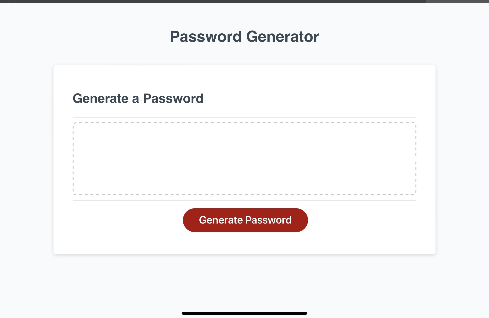
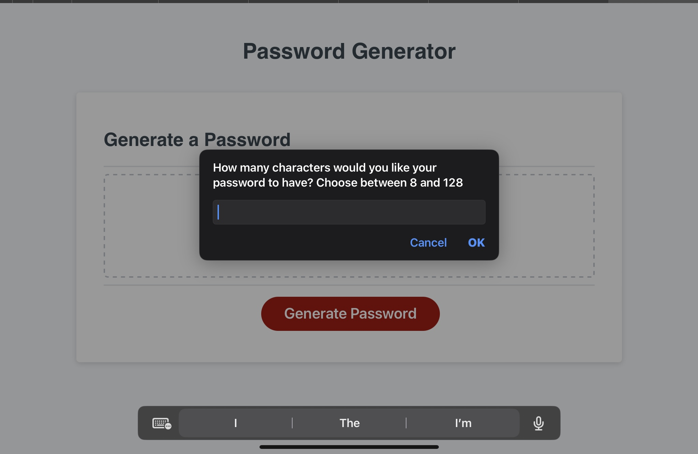
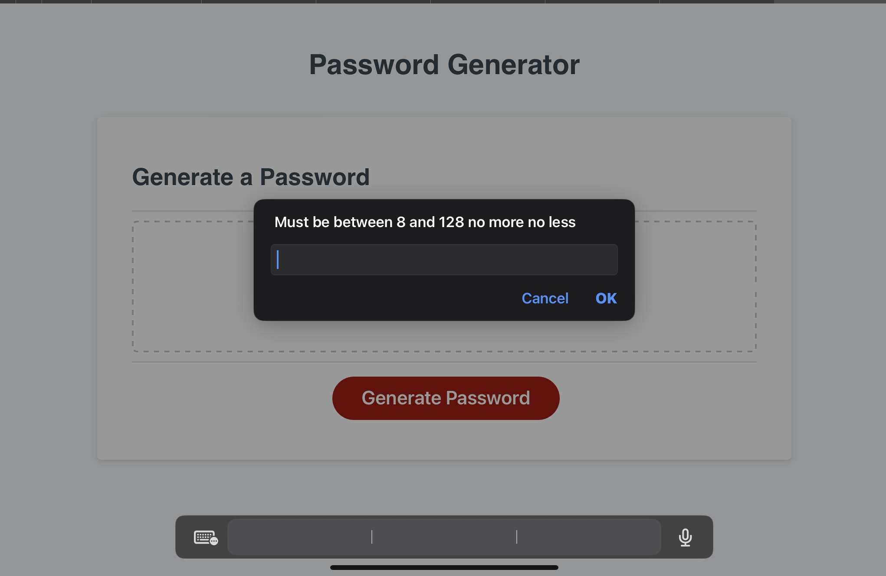
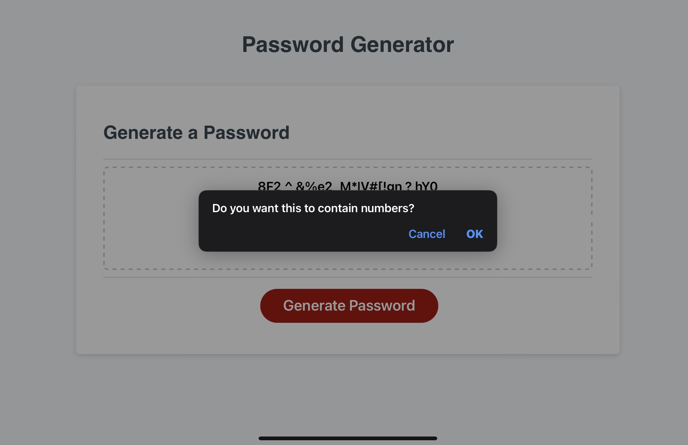
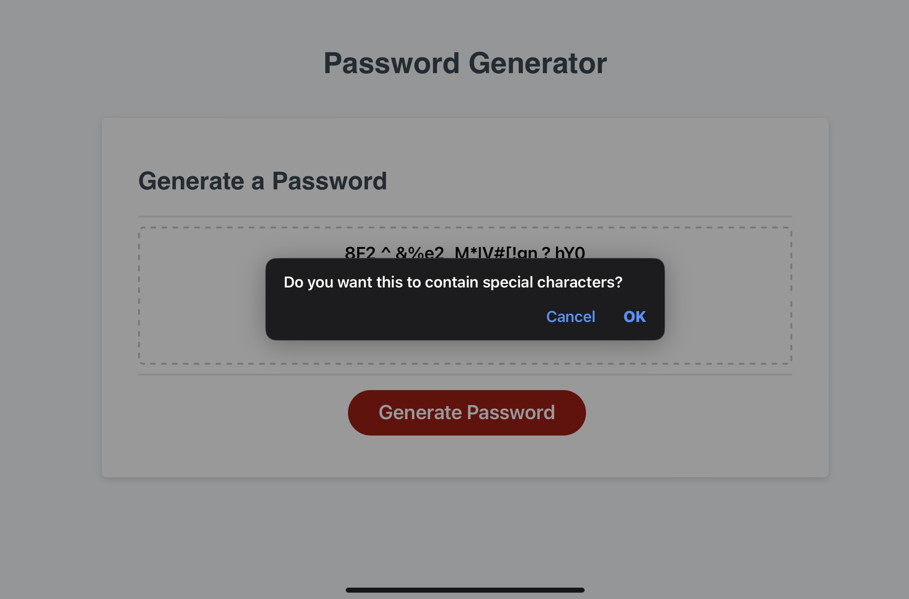
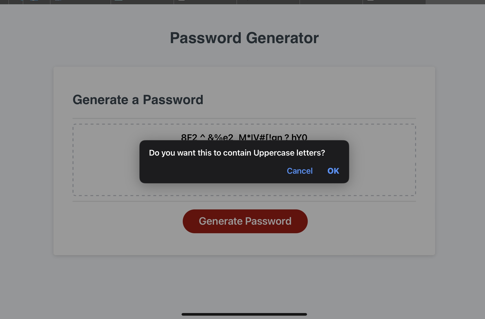
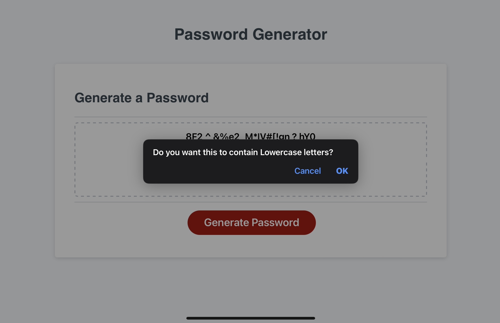
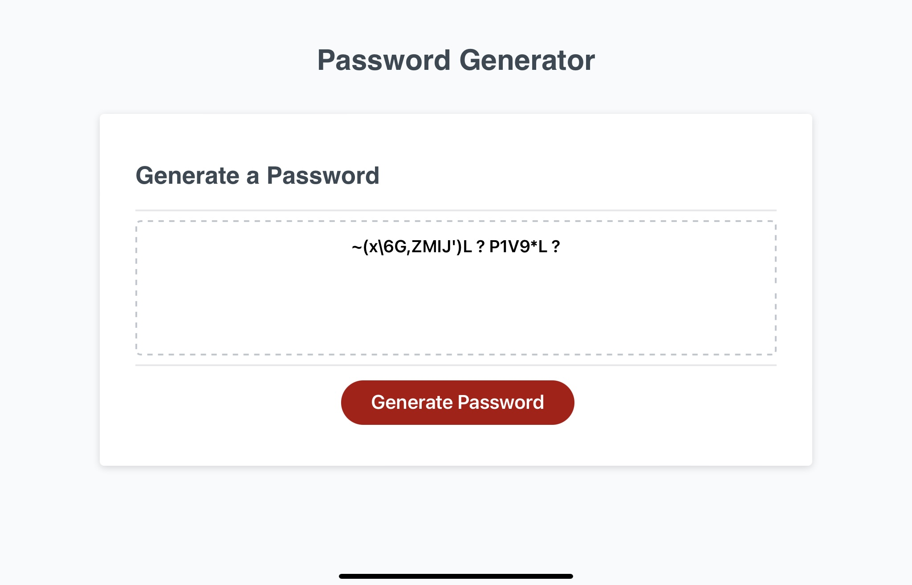

https://bs3102798.github.io/Password-Creator/root/
## Description

This project was to help people creat all sorts of strong passwords for anyones who is in need to have them. This was to help anyone who wanted to have a creative and different password for any need they would want. This solves or creats someones password from being a weak one that can be hack into easy. To a strong one that pretect there accounts. In this project I have learned how to link html, css, and javaScript and creat multiple function to work together to creat a random string for a password. 

## Features

In image 0 this shows the initial front page that has a clickable button to creat the password.

In image 1 once you click the generate Password button you will see a pop up with a option to choose 8-128 characters for a password.

But if you choose lower than 8 and higher than 128 you will see this pop up saying "must be between 8 and 128 no more no less."

when you choose 8-128 character you will see "Do you want this to contain numbers?" click confirm and the password will have numbers.

Next you will have an option to have special characters in your password. Click confirm.

After that you will have an option to have Uppercase letter in your password.
Click confirm. 

Lastly you will have an option to have Lowercase letter in your password.
Click confirm.

Finaly once you confirm the last prompt you will see your newly Generated Password
